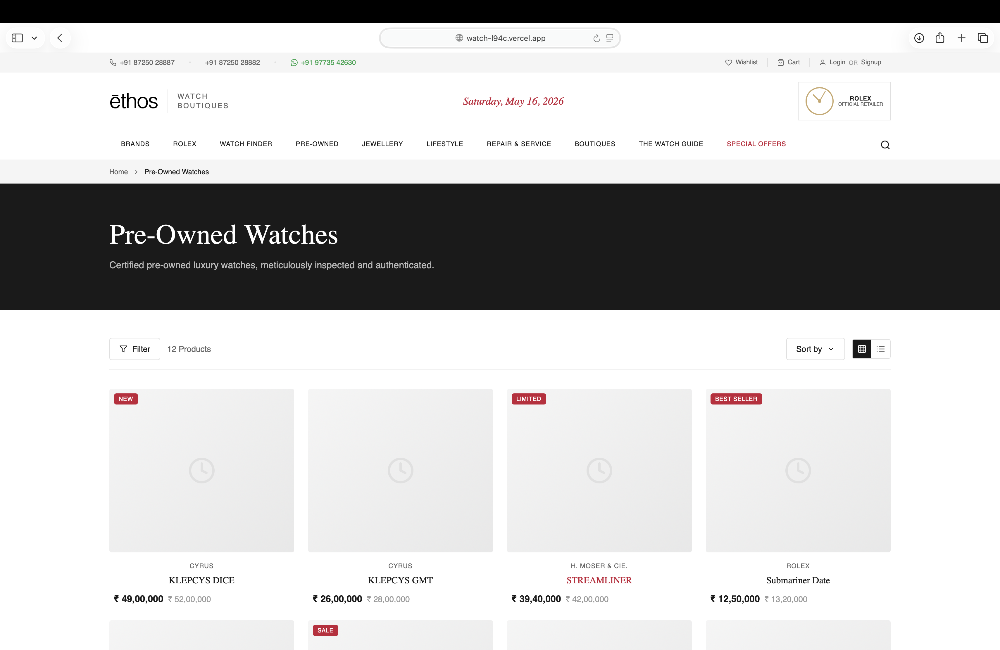

# Ethos Watch Boutiques - Next.js

A premium luxury watch storefront built with Next.js 14, TypeScript, and Tailwind CSS. This polished landing experience showcases high-end watch collections, editorial stories, boutique locations, and an elegant responsive design.

## Project Preview




## Why this project is special

- **Luxury UI** — Modern editorial layout inspired by premium watch boutiques
- **Responsive by design** — Mobile-first flows with desktop refinements
- **Dynamic sections** — Hero, articles, boutique locator, featured watches, studios, and trending stories
- **Brand-focused styling** — Soft neutrals, gold accents, and premium typography
- **Fast Next.js experience** — App Router powered static-friendly pages

## Tech Stack

- Next.js 14 (App Router)
- React 18
- TypeScript
- Tailwind CSS
- Lucide React icons

## Setup

### Prerequisites

- Node.js 18+
- npm or yarn

### Install

```bash
cd ethos-watches-nextjs
npm install
```

### Run locally

```bash
npm run dev
```

Open [http://localhost:3000](http://localhost:3000).

### Build for production

```bash
npm run build
```

## Project Structure

```
ethos-watches-nextjs/
├── app/
│   ├── components/
│   │   ├── TopBar.tsx
│   │   ├── Header.tsx
│   │   └── Navbar.tsx
│   ├── sections/
│   │   ├── Hero.tsx
│   │   ├── Articles.tsx
│   │   ├── NewArrivals.tsx
│   │   ├── Boutique.tsx
│   │   ├── FeaturedWatches.tsx
│   │   ├── Studios.tsx
│   │   ├── Trending.tsx
│   │   └── Footer.tsx
│   ├── globals.css
│   ├── layout.tsx
│   └── page.tsx
├── public/
│   └── images/          # Showcase screenshots and media
├── next.config.js
├── tailwind.config.ts
├── tsconfig.json
└── package.json
```

## Notes

- Replace the screenshot files in `public/images` to update the README preview images.
- This project is ideal for luxury watch showroom experiences and editorial storefront demos.

## Developer

Built and developed by **samjoshua**.
